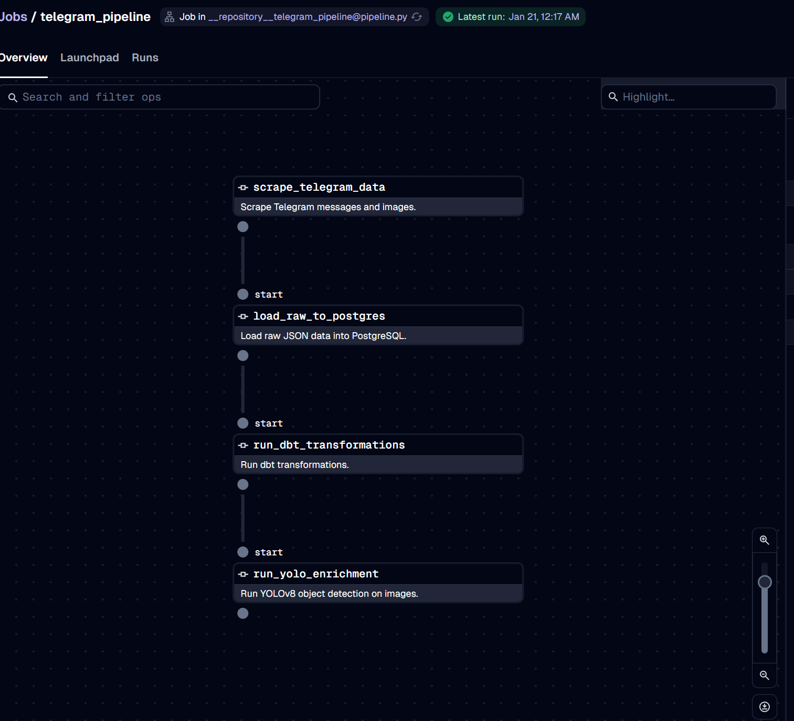
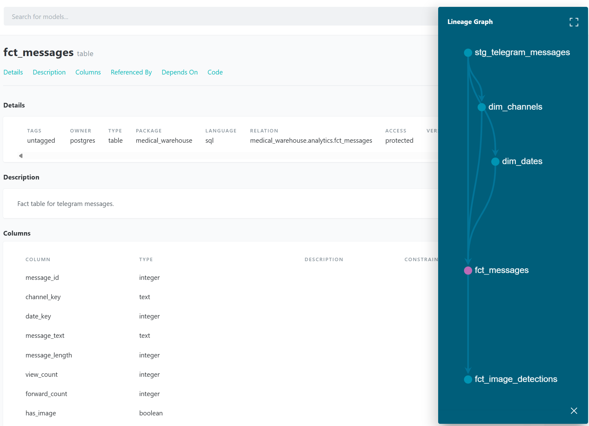
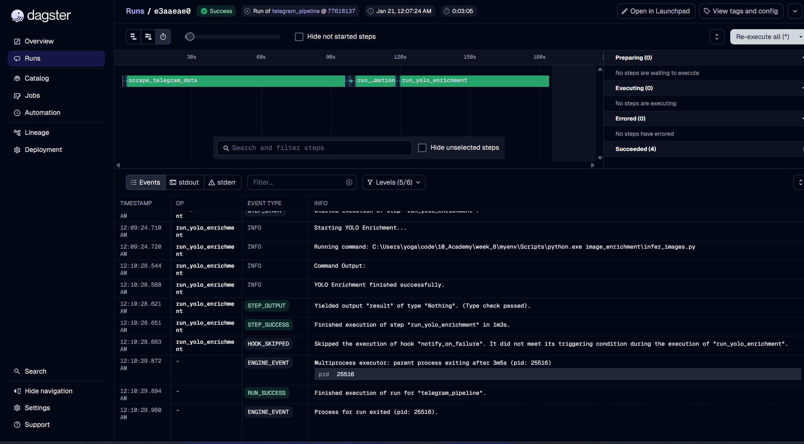
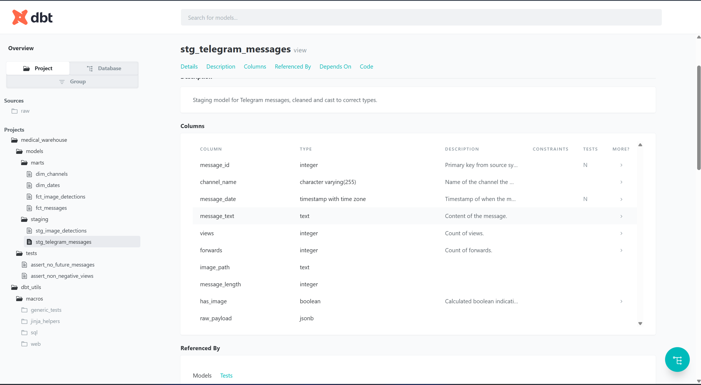
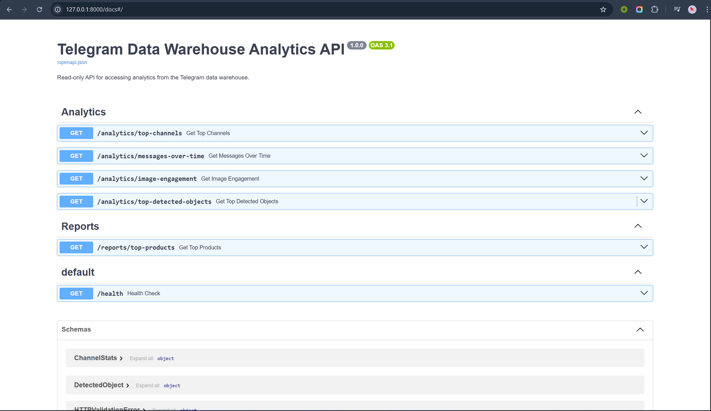

# Medical Telegram Channel ELT Pipeline

## 1. Project Title and Overview

**Project Title:** Ethiopian Medical Business Data Warehouse & Analysis Pipeline

**Overview:**
This project implements a comprehensive **ELT (Extract, Load, Transform)** data pipeline to collect, process, and analyze data from multiple Ethiopian medical-related Telegram channels. The goal is to centralize scattered advertising and product data into a structured Data Warehouse to enable business intelligence, trend analysis, and object detection on shared images.

**ELT vs ETL:**
We utilize an **ELT** approach where raw data is first loaded into the data warehouse (PostgreSQL) and then transformed using **dbt**. This allows for greater flexibility, audibility of raw data, and the ability to restate transformations without re-scraping.

**Applications:**
- **Market Intelligence:** Tracking product mentions (medicines, equipment) across channels.
- **Price Monitoring:** Extracting and analyzing price trends (future scope).
- **Ad Effectiveness:** Correlating message views with content type (text vs. image).
- **Content Analysis:** Using Computer Vision (YOLO) to identify objects in shared images.

## 2. Architecture Diagram

The high-level architecture of the pipeline is illustrated below:



*Figure 1: End-to-End ELT Pipeline Flow*

The data is modeled using a **Star Schema** optimized for analytical queries:


*(Note: Ensure star_schema.png is present in docs/screenshots/)*

*Figure 2: Data Warehouse Star Schema*

## 3. Installation Instructions

### Prerequisites
- **Python 3.10+**
- **PostgreSQL** database (running locally or remotely)
- **Telegram API Credentials** (API_ID, API_HASH) for the scraper.

### Setup Steps

1.  **Clone the Repository:**
    ```bash
    git clone <repository_url>
    cd <repository_name>
    ```

2.  **Create and Activate Virtual Environment:**
    ```bash
    # Windows
    python -m venv venv
    .\venv\Scripts\activate

    # Linux/Mac
    python3 -m venv venv
    source venv/bin/activate
    ```

3.  **Install Dependencies:**
    ```bash
    pip install -r requirements.txt
    ```

4.  **Environment Variables:**
    Create a `.env` file in the root directory:
    ```env
    # Telegram API
    TG_API_ID=your_api_id
    TG_API_HASH=your_api_hash
    phone=your_phone_number

    # Database
    DB_NAME=medical_warehouse
    DB_USER=your_db_user
    DB_PASSWORD=your_db_password
    DB_HOST=localhost
    DB_PORT=5432
    ```

## 4. Project Structure

```text
├── api/                    # FastAPI application
│   ├── main.py             # App entry point
│   ├── database.py         # DB connection via SQLAlchemy
│   ├── routers/            # API endpoints (analytics.py)
│   └── schemas/            # Pydantic models
├── data/                   # Local storage for raw scraped data and images
├── docs/                   # Documentation and screenshots
├── image_enrichment/       # YOLOv8 Object Detection
│   ├── infer_images.py     # Inference script
│   └── yolo_enrichment.py  # Wrapper for pipeline
├── medical_warehouse/      # dbt project
│   ├── models/             # Staging and Marts (SQL)
│   ├── tests/              # Schema and custom tests
│   └── dbt_project.yml     # dbt configuration
├── src/                    # Core ELT scripts
│   ├── scraper.py          # Telegram channel scraper
│   └── load_raw_to_postgres.py # Raw data loader
├── pipeline.py             # Dagster orchestration pipeline
└── requirements.txt        # Project dependencies
```

## 5. Usage

### 1. Scraper Description
The scraper connects to defined Telegram channels and downloads messages and images.
```bash
python src/scraper.py
```

### 2. Loading Raw Data
Loads the scraped JSON data into the `raw.telegram_messages` table in PostgreSQL.
```bash
python src/load_raw_to_postgres.py
```

### 3. dbt Transformations
Transforms raw data into a Star Schema (Dimensions and Facts).
```bash
cd medical_warehouse
dbt deps
dbt build  # Runs models and tests
```

### 4. YOLO Object Detection
Runs the YOLOv8 model on downloaded images and loads detection results into the DB.
```bash
python image_enrichment/infer_images.py
```

### 5. FastAPI Server
Starts the REST API for accessing analyzed data.
```bash
uvicorn api.main:app --reload
```
API Documentation will be available at: `http://127.0.0.1:8000/docs`

### 6. Dagster Pipeline
Runs the orchestration UI to manage and monitor the entire pipeline.
```bash
dagster dev -f pipeline.py
```
Dagster UI: `http://127.0.0.1:3000`

## 6. Analytical Features / Endpoints

The API provides the following endpoints:

-   **GET /analytics/top-products**: Returns the most frequently mentioned medical keywords/products.
-   **GET /analytics/channel-activity**: Returns message volume trends per channel over time.
-   **GET /analytics/search**: Allows full-text search across all collected messages.
-   **GET /analytics/visual-stats**: Returns statistics on objects detected in images (e.g., number of "Person", "Bottle" detections).

## 7. Screenshots

### Dagster Pipeline Execution


### dbt Documentation


### FastAPI Swagger UI


## 8. Key Technical Decisions

-   **PostgreSQL:** Chosen as the primary data warehouse for its robust JSONB support (handling raw Telegram data) and strong integration with dbt.
-   **dbt (data build tool):** Selected for transformation to bring software engineering best practices (version control, testing, modularity) to SQL.
-   **YOLOv8:** Utilized for object detection due to its state-of-the-art accuracy and speed, enabling "visual content analysis" of ad images.
-   **FastAPI:** Chosen for the API layer because of its high performance (async), automatic documentation (Swagger), and type safety (Pydantic).
-   **Dagster:** Implemented as the orchestrator to manage dependencies between the Python scripts (extract/load) and dbt models, providing visibility and error handling.

## 9. Data Model / Star Schema

We implemented a Star Schema for efficient query performance:

-   **Fact Table:** `fct_messages`
    -   Contains metrics: `view_count`, `forward_count`, `shared_count`.
    -   Foreign keys to dimensions.
-   **Fact Table:** `fct_image_detections`
    -   Contains metrics about objects detected in images.
-   **Dimension Tables:**
    -   `dim_channels`: Channel metadata (ID, title, username).
    -   `dim_dates`: Date dimension for time-series analysis.
    -   `dim_products`: Extracted product entities (if available).

**Surrogate Keys:** We generate surrogate keys in dbt (md5 hashes) to ensure uniqueness and handle changes in source system IDs gracefully.

## 10. Data Quality Measures

-   **dbt Tests:** We use `unique` and `not_null` tests on primary keys.
-   **Custom Tests:** SQL tests to ensure `date` fields are valid and `view_counts` are non-negative.
-   **Data Cleaning:**
    -   Deduplication of messages based on `message_id` and `channel_id`.
    -   Handling of missing values (coalescing to defaults).
    -   Standardization of text fields.

## 11. Pipeline Orchestration

The Dagster pipeline (`pipeline.py`) defines the workflow:

1.  **Op:** `scrape_telegram_op` - Runs the scraping script.
2.  **Op:** `load_data_op` - Loads JSON to Postgres.
3.  **Asset:** `dbt_assets` - Triggers the dbt project build.
4.  **Op:** `yolo_enrichment_op` - Runs the image inference.

**Dependencies:** Scrape -> Load -> dbt -> YOLO.

## 12. Challenges and Learnings

-   **Data Consistency:** Telegram data can be messy (edited messages, unstructured text). We solved this by using a "Raw" layer in Postgres to capture everything as-is before transforming.
-   **YOLO Integration:** Mapping image detections back to specific messages required careful handling of filenames and message IDs.
-   **Environment Management:** Coordinating dependencies between dbt, simple python scripts, and the API required a unified virtual environment and careful `requirements.txt` management (e.g., handling `dbt-postgres` and `sqlalchemy`).

---
**License:** MIT
**References:** [10 Academy](https://www.10academy.org/), [Dagster Docs](https://docs.dagster.io/), [dbt Docs](https://docs.getdbt.com/)
